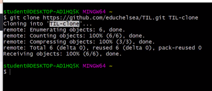
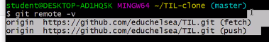
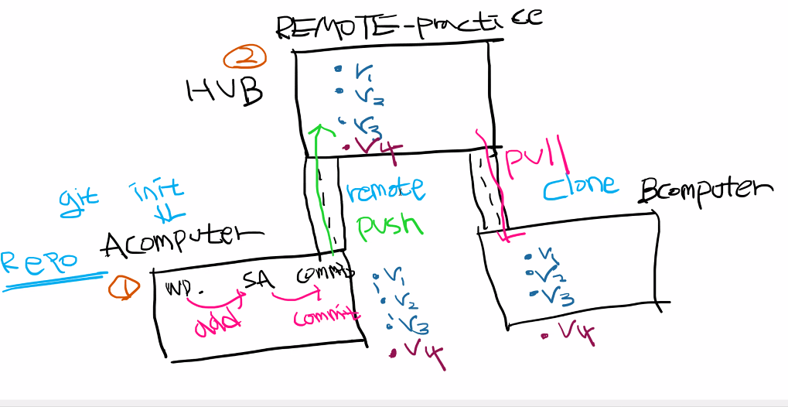
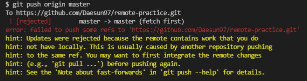
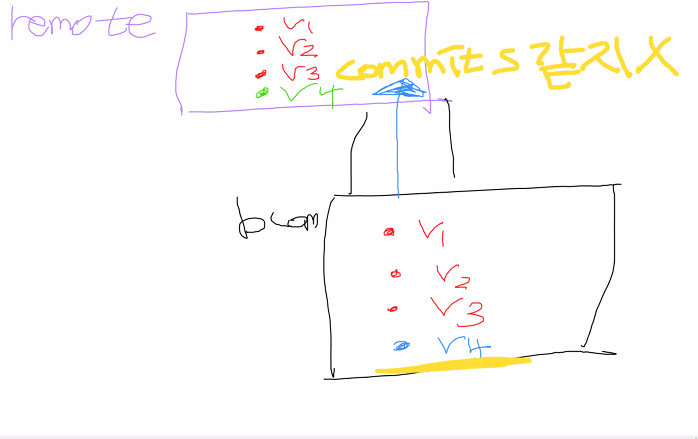

- 상향식 : 로컬에서 만들고 길내서 허브와 연결 (remote), push로 올림
- 하향식 : 허브에 있는 것을 복제(clone)하여 생성 연결 필요 없음 연결자동 **무조건 홈폴더에서 함**
  - git clone 허브주소 생성되는 폴더 이름 (배쉬에서)
- git (push,pull) origin master

엡데이트 된걸 풀로 들고온다는 느낌

같은 파일 같은 폴더에 겹치면 이 에러가 뜸

다른 컴퓨터에서 push한 commit과 이번에 push 한 commit이 같지 않아서 뜸

충돌나면 

1. pull
2. 3번째 회색글씨 선택
3. add
4. commit
5. log --oneline로 확인해보기