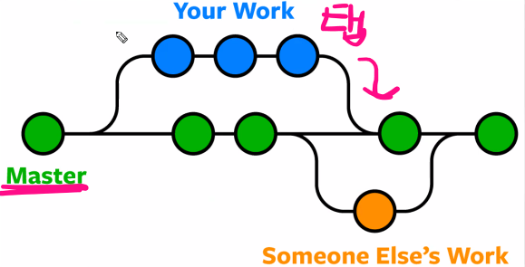
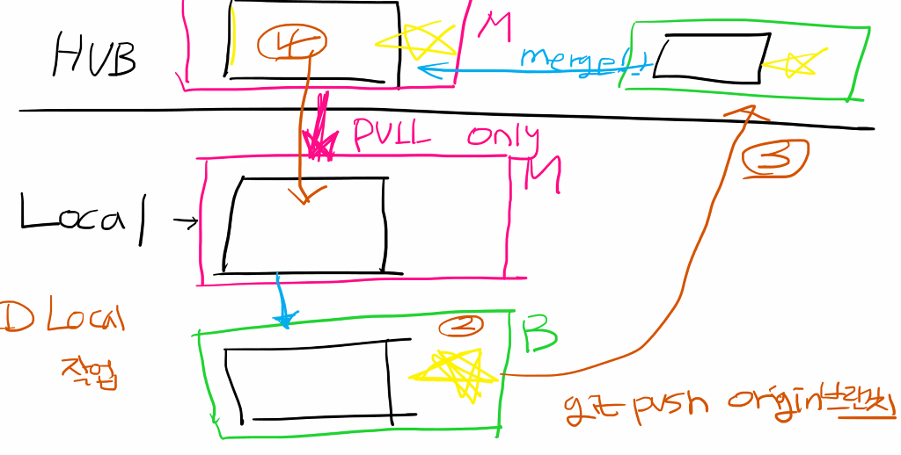
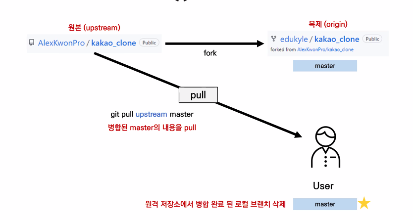

마스터 브랜치에만 작업을 하는 것이 아니라 새로운 브랜치를 만들어서 작업하여 추가함, 안정성과 효율이 뛰어남

# git branch

- 브랜치 목록 확인(지금 LR)
  - git branch -r(원격 저장소 브랜치 목록도 확인)
  - 새로운 브랜치에서 원래 브랜치 (master,main)으로 오면 새로운 브랜치에서 작성한 건 안보임. 
  - 로그 전부 보려면 log --oneline --all으로 봐야함.

​			

## 새로운 브랜치 생성

- git branch **브랜치이름**
  - 신규 브랜치 생성 [특정 커밋 기준,해쉬값] (git branch 신규브랜치명 해쉬값)

## 해당 브랜치로 이동

- git switch **브랜치이름**

  - 브랜치 생성 및 바로 이동 = git switch -c 브랜치명

  -  git switch -c 해쉬값

##  브랜치 삭제

- git branch -d 브랜치명(대문자는 강제삭제)

## 브랜치 합치기

- git merge **브런치이름** = 현제 브런치를 기준으로 **브런치이름** 을 합침

## 풀 리퀘스트

 

- LR을 바로 마스터(HUB)로 push하는 것이 아니라 브랜치에서 작업
- 작업을 한뒤 브랜치를 마스터(HUB)로 올림
-  마스터(HUB)에서 마지
- 그걸 LR로 풀
- 반복

## Workflow 깃에서 협업하는 방법

- 소유권이 있는 코드를 클론하여 가져옴

  - 여러명이 브랜치를 만들어서 허브에 올림

   	1. pull request
   	1. 허브의 데이터 풀로 가져옴
   	1. 브랜치 삭제 

## Foking Workflow

- 소유권이 없는 자료를 포크로 떠서(복제하여) 사용함

  1. 복제한 것 기능추가를 위해 풀해서 브랜치로 코드 업그레이드
  2. 내허브에 푸시
  3. 풀리퀘스트를 원본허브로 보냄
  4. 병합이 완료되면 복제품에  적용 (브랜치 삭제)
  5. 원본에서 풀로 들고옴
  6. 반복

  

  **바로 클론떠서 안하는 이유**

- 포크로 복제해서 내 허브로 복제해서 안하고 그냥 클론해서 하면 push 시 403에러 뜸

 