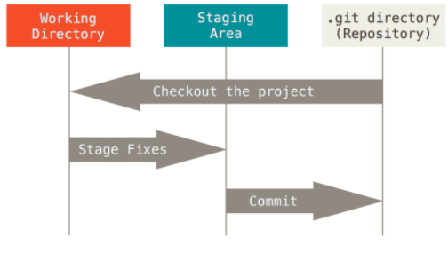

# 초기설정
- 처음 한번만 설정
    1. 누가 커밋 기록을 남겻는지 볼수있도록 이름, 메일 주소만 다르게 하여 동일 하게 입력

        $ git config --global user.name "이름"
        $ git config __global user.email "메일 주소"
        깃허브 닉네임과 깃허브 아이디

    2. 작성자가 올바르게 설정됐는지 확인 가능

        $ git config --global -1
        Or
        $ git config --global --list


# Git 기본 명령어




- **Working Directory**(Working Tree)= 일반적인 작업이 일어나는 곳
- **Staging Area**(Index)= 커밋을 위한 파일 및 폴더가 추가되는 곳
- **Repository** = Staging Area에 있던 파일 및 폴더의 변경사항 (Commit)을 저장하는곳
- 위의 순서대로 버전 관리를 수행함

## git init

```


